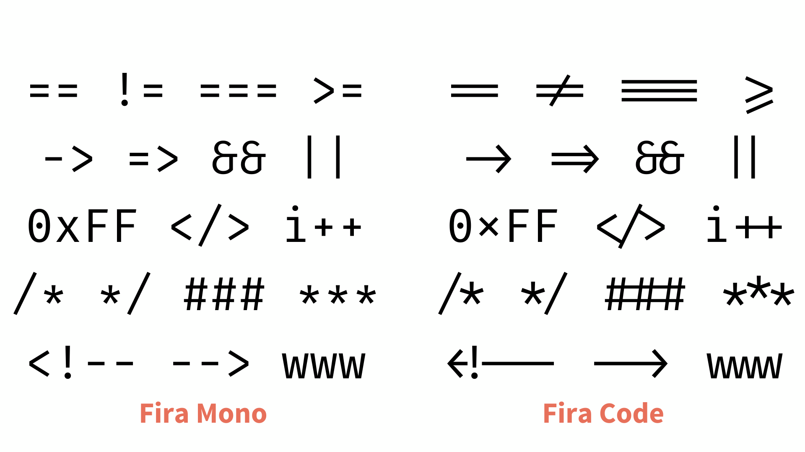

 

  
  <h1>Awesome Linux Ricing</h1>
  <h4>Carefully curated list of awesome Linux customization resources</h4>
  

 

	<a href="CONTRIBUTING.md">Contribution</a>&nbsp;&nbsp;•&nbsp;
	<a href="code_of_conduct.md">Code of Conduct</a>&nbsp;&nbsp;•&nbsp;
	<a href="LICENSE">License</a>

 

## Description

This very cool list is made to help anyone interested in extensively customizing their Linux desktop, or what we call 'ricing'. It's a very good place to start your adventure, helping you discover what you can use, or what **ELSE** you can use to over-customize your rice. The goal is to have some of the very popular themes and tools, as well as some lesser-known ones, to help you find that perfect fit. It's your go-to list when you need to waste your time ricing, instead of tendign to your responsibilities.

## Contents

<!-- START doctoc generated TOC please keep comment here to allow auto update -->
<!-- DON'T EDIT THIS SECTION, INSTEAD RE-RUN doctoc TO UPDATE -->

- [Window Manager](#window-manager)
  - [Stacking](#stacking)
  - [Tiling](#tiling)
  - [Dynamic](#dynamic)
- [Color Scheme](#color-scheme)
  - [Utilities](#utilities)
- [Wallpapers](#wallpapers)
  - [Utilities](#utilities-1)
- [Font](#font)
  - [Sans Fonts](#sans-fonts)
  - [Monospace Fonts](#monospace-fonts)
  - [Nerd Fonts](#nerd-fonts)
- [Bar](#bar)
- [Cursor](#cursor)
  - [Utilities](#utilities-2)
- [Icons](#icons)
- [Application Launcher](#application-launcher)
- [Notifications Daemon](#notifications-daemon)
- [Widgets](#widgets)
- [Logout Menu](#logout-menu)
- [Screen Lock](#screen-lock)
- [Terminal](#terminal)
  - [Emulator](#emulator)
  - [Shell](#shell)
  - [Prompt](#prompt)
  - [Multiplexer](#multiplexer)
  - [Tools](#tools)
    - [File Manager](#file-manager)
    - [Editor](#editor)
    - [Image Printing](#image-printing)
    - [System Monitoring](#system-monitoring)
    - [Mail Client](#mail-client)
    - [Screenshot](#screenshot)
    - [Recording](#recording)
    - [Directory Listing](#directory-listing)
    - [Misc](#misc)
  - [Fancies](#fancies)
    - [Fetch](#fetch)
    - [Terminal Visuals](#terminal-visuals)
    - [Clock](#clock)
    - [Audio Visualizer](#audio-visualizer)
    - [Matrix](#matrix)
    - [Character Play](#character-play)
    - [Pokemon-Themed](#pokemon-themed)
    - [Text and Fonts](#text-and-fonts)
- [UI Apps/Tools](#ui-appstools)
  - [Web Browser](#web-browser)
  - [File Manager](#file-manager-1)
  - [Image Viewer](#image-viewer)
  - [Music Player](#music-player)
  - [Video Streamer](#video-streamer)
  - [Document Reader](#document-reader)
  - [Text Editor](#text-editor)
  - [Archive Manager](#archive-manager)
  - [Email](#email)
  - [Calculator](#calculator)
  - [Notes](#notes)
  - [Workstation - Content Creation](#workstation---content-creation)
    - [Image Editing](#image-editing)
    - [Video Editing](#video-editing)
    - [Music Production](#music-production)
    - [3D](#3d)
    - [Office](#office)
    - [Screen Recording / Live Streaming](#screen-recording--live-streaming)
  - [Gaming](#gaming)
- [GUI Apps Ricing](#gui-apps-ricing)
  - [Firefox](#firefox)
    - [Theme](#theme)
    - [Startpage](#startpage)
  - [Spotify](#spotify)
  - [Discord](#discord)
  - [VSCode](#vscode)
- [Display Manager](#display-manager)
- [GRUB](#grub)
- [Installation and Configuration](#installation-and-configuration)
- [Contribution](#contribution)

<!-- END doctoc generated TOC please keep comment here to allow auto update -->

---

## Window Manager

  
<b>Window Manager (WM) vs Desktop Environment (DE)</b>

  
A <b>WM</b> is a software that manages the windows on your screen. It controls the placement and appearance of windows, and provides basic functionality like window resizing and moving.

  
A <b>DE</b> is a collection of software that provides a complete desktop experience. It includes the <b>window manager</b>, along with a file manager, a bar/panel, and other apps, tools and utilities.

  
<b>DEs</b> usually provide a more integrated and user-friendly experience, while <b>WMs</b> are more lightweight and customizable, requiring you to manually configure and install additional software to get the same functionality as a <b>DE</b>, but with more control over the look and feel of your desktop.

 

  
<b>Stacking vs Tiling vs Dynamic WMs</b>

  <ul>
    <li><b>Stacking WMs</b> are traditional window managers that place windows on top of each other (like MS Windows). They allow you to move and resize windows freely, but they can be cluttered and hard to manage with many windows open.</li>
    <li><b>Tiling WMs</b> automatically arrange windows in a non-overlapping layout. They are efficient and help you make the most of your screen space, but they can be less flexible than stacking WMs.</li>
    <li><b>Dynamic WMs</b> combine the best of both worlds. They allow you to switch between tiling and stacking layouts, giving you the flexibility to choose the best layout for your workflow.</li>
  </ul>

 

  
<b>X11 vs Wayland</b>

  
<b>X11</b> is the traditional display server protocol used in Linux. It is mature and stable, but it has some limitations in terms of security and performance.

  
<b>Wayland</b> is a newer display server protocol that aims to address the limitations of <b>X11</b>. It is more secure and efficient, allowing for better performance, smoother animations, touch gestures, etc. However, it is still under development, and usually Nvidia GPUs have issues with it.

  
All applications with a GUI (as well as WMs) are run under a display server and are usually developed for a specific display server protocol, meaning you can't run a <b>Wayland</b> app on <b>X11</b>, or vice versa. However, it is possible to use a compatibility layer like XWayland to run <b>X11</b> apps on <b>Wayland</b>.

 

### Stacking

- [GNOME](https://gitlab.gnome.org/GNOME)X11 + Wayland - Modern desktop environment that aims to be simple and easy to use.
- [KDE](https://kde.org/)X11 + Wayland - Feature-rich and versatile desktop environment.
- [XFCE](https://www.xfce.org/)X11 - Lightweight desktop environment. It aims to be fast and low on system resources, while still being visually appealing and user-friendly.
- [Openbox](http://openbox.org/)X11 - Highly configurable next generation window manager with extensive standards support.

### Tiling

- [bspwm](https://github.com/baskerville/bspwm)X11 - Tiling window manager that represents windows as the leaves of a full binary tree.
- [i3](https://github.com/i3/i3)X11 - Tiling window manager for X11.
- [sway](https://github.com/swaywm/sway)Wayland - Tiling Wayland compositor and a drop-in replacement for the i3 window manager for X11.
- [herbstluftwm](https://github.com/herbstluftwm/herbstluftwm)X11 - Manual tiling window manager for X.
- [leftwm](https://github.com/leftwm/leftwm)X11 - Tiling window manager written in Rust for advanced.

### Dynamic

- [Ηyprland](https://github.com/hyprwm/Hyprland)Wayland - Highly customizable dynamic tiling Wayland compositor that doesn't sacrifice on its looks.
- [awesome](https://github.com/awesomeWM/awesome)X11 - Highly configurable, next generation framework window manager for X.
- [QTile](https://github.com/qtile/qtile)X11 + Wayland - Full-featured, hackable tiling window manager.
- [XMonad](https://github.com/xmonad/xmonad)X11 - Small but functional ICCCM-compliant tiling window manager.
- [dwm](https://dwm.suckless.org/)X11 - Dynamic window manager for X. It manages windows in tiled, monocle and floating layouts.
- [river](https://github.com/riverwm/river)Wayland - Dynamic tiling Wayland compositor with flexible runtime configuration.
- [ragnar](https://github.com/cococry/ragnar)X11 - Minimal, flexible & user-friendly X tiling window manager.

## Color Scheme

  
<b>What are color schemes</b>

  Color schemes in ricing are a set of carefully selected colors used to create a theme. You can pick and use a specific theme you like to customize the colors of all your configurable apps (i.e WM, bar, terminal, browser, etc...), in order to achieve a consistent look and feel across your desktop.

 

- [Catppuccin](https://github.com/catppuccin/catppuccin) - Soothing pastel theme for the high-spirited.
- [Gruvbox](https://github.com/morhetz/gruvbox) - Retro groove color scheme.
- [Nord](https://github.com/nordtheme/nord) - Arctic, north-bluish color palette.
- [Everforest](https://github.com/sainnhe/everforest) - Comfortable and pleasant green forest color scheme.
- [Dracula](https://github.com/dracula/dracula-theme) - Dark spooky theme.
- [Rosé Pine](https://github.com/rose-pine/rose-pine-theme) - All natural pine, faux fur and a bit of soho vibes for the classy minimalist.
- [Tokyo Night](https://github.com/enkia/tokyo-night-vscode-theme#other-ports) - Clean, dark theme that celebrates the lights of Tokyo at night.
- [Sweet](https://github.com/EliverLara/Sweet) - Colorful candy theme.
- [Kanagawa](https://github.com/rebelot/kanagawa.nvim) - Dark color scheme inspired by the famous painting.
- [BlackLotus](https://github.com/PoisonIsBestType/BlackLotus) - Dark, dim, blue, purple... beautiful.
- [Whale](https://github.com/anufrievroman/whale) - Dark theme inspired by Ark and Nord.
- [Everblush](https://github.com/Everblush/everblush) - Dark, vibrant and beautiful Colorscheme.
- [Shades of purple](https://github.com/EliverLara/Shades-of-purple-gtk) - Sweet purple theme.
- [opulo](https://github.com/kewmine/opulo) - Colorscheme for absolute nerds.
- [camellia](https://github.com/camellia-theme/camellia) - Dark yet vibrant color scheme.

### Utilities

- [pywall](https://github.com/dylanaraps/pywal) - Generate and change color-schemes according to your wallpaper.
- [wpgtk](https://github.com/deviantfero/wpgtk) - Colorscheme, wallpaper and template manager.

## Wallpapers

Some great GitHub repos with wallpaper collections by:
- [dharmx](https://github.com/dharmx/walls)
- [linuxdotexe](https://github.com/linuxdotexe/nordic-wallpapers)Nord
- [D3Ext](https://github.com/D3Ext/aesthetic-wallpapers)
- [FrenzyExists](https://github.com/FrenzyExists/wallpapers)
- [AngelJumbo](https://github.com/AngelJumbo/gruvbox-wallpapers)Gruvbox
- [zhichaoh](https://github.com/zhichaoh/catppuccin-wallpapers)Catppuccin
- [Apeiros-46B](https://github.com/Apeiros-46B/everforest-walls)Everforest
- [gboncoffee](https://github.com/gboncoffee/wallpapers)
- [zDyanTB](https://github.com/zDyanTB/aesthetic-wallpapers)
- [vctrblck](https://github.com/vctrblck/gruvbox-wallpapers)Gruvbox
- [jorgeloopzz](https://github.com/jorgeloopzz/Wallpapers)
- [Axenide](https://github.com/Axenide/Wallpapers)

### Utilities

- [swww](https://github.com/Horus645/swww)Wayland - Efficient animated wallpaper daemon for wayland, controlled at runtime.
- [mpvpaper](https://github.com/GhostNaN/mpvpaper)Wayland - Video wallpaper program for wlroots based wayland compositors.
- [swaybg](https://github.com/swaywm/swaybg)Wayland - Wallpaper tool for Wayland compositors
- [hyprpaper](https://github.com/hyprwm/hyprpaper)Wayland - Fast Wayland wallpaper utility with IPC controls.

## Font

  
<b>Sans vs Serif vs Mono</b>

  <ul>
    <li><b>Serif</b> fonts have decorative lines or strokes at the ends of the letters. They are often used for body text in printed materials.</li>
    <li><b>Sans-serif</b> fonts are modern and clean, without the decorative flourishes of serif fonts. They are often used for headings and titles.</li>
    <li><b>Monospace</b> fonts have equal spacing between characters, making them ideal for coding, editors and terminals.</li>
  </ul>
    
<b>Sans</b> and <b>Mono</b> are the ones usually used for ricing, as they are more readable and modern.

 

  
<b>What are ligatures</b>

  
<b>Ligatures</b> are special characters that combine two or more letters into a single glyph. They are used to improve the appearance and readability of text, especially in code and terminal applications.

  
Example:

  

 

### Sans Fonts
- [Google Sans](https://font.download/font/google-sans)ligatures - Google's custom and versatile sans-serif font.
- [Open Sans](https://fonts.google.com/specimen/Open+Sans) - The peace and love issue.
- [Roboto](https://fonts.google.com/specimen/Roboto) - The Android font.
- [Ubuntu](https://fonts.google.com/specimen/Ubuntu) - The Ubuntu font.
- [DejaVu](https://github.com/dejavu-fonts/dejavu-fonts) - Font family based on Bitstream Vera.

### Monospace Fonts
- [JetBrains Mono](https://github.com/JetBrains/JetBrainsMono)ligatures - Τypeface made for developers.
- [FiraCode](https://github.com/tonsky/FiraCode)ligatures - Monospaced font with programming ligatures.
- [Cascadia Code](https://github.com/microsoft/cascadia-code)ligatures - Fun font designed to enchance the modern look and feel of the *** Terminal.
- [Iosevka](https://github.com/be5invis/Iosevka)ligatures - Versatile typeface for code, from code.
- [Victor Mono](https://github.com/rubjo/victor-mono)ligatures - Free programming font with cursive italics and ligatures.
- [DejaVuCode](https://github.com/SSNikolaevich/DejaVuSansCode)ligatures - Monospaced font with programming ligatures based on DejaVu Sans Mono.
- [Gohufont](https://github.com/hchargois/gohufont) - Monospace bitmap font.
- [Operator-caska](https://github.com/Anant-mishra1729/Operator-caska-Font)ligatures - Font with ligature and cursive support, combination of both CaskaydiaCove Nerd Font and Operator Mono.
- [monoid](https://github.com/larsenwork/monoid)ligatures - Customisable coding font with alternates, ligatures and contextual positioning.
- [Hasklig](https://github.com/i-tu/Hasklig)ligatures - Code font with monospaced ligatures.

### Nerd Fonts

  
<b>What are the Nerd Fonts</b>

    
<b>Nerd Fonts</b> are patched fonts that contain additional glyphs, icons, and ligatures. These fonts are designed to be used in terminals and code editors, providing a more visually appealing and functional experience. <b>Nerd Fonts</b> are compatible with most of the font families.

 

- [Nerd Fonts](https://github.com/ryanoasis/nerd-fonts) - Collection of nerd fonts.
- [font-patcher](https://github.com/ryanoasis/nerd-fonts?tab=readme-ov-file#font-patcher) - Patch your own fonts.
- [getnf](https://github.com/getnf/getnf) - Helpful tool to install Nerd Fonts.

> [!TIP]
> In order to make use of glyphs, you should at least have one nerd font installed on your system. Setting your default font as a nerd font is usually not required, as it may show glyphs smaller than they are supposed to be. However, you may need to include a nerd font family along with your default font, when configuring fonts for an application, in order to display the glyphs properly.

## Bar

  
<b>What is a bar</b>

  
A <b>bar</b> is a graphical element usually used to display a variety of information, like the time, date, battery, volume, etc, like the "Task Bar" in Windows and the "Menu Bar" in MacOS. It is usually placed at the top or bottom of the screen, and can be customized in any style.

 

- [Polybar](https://github.com/polybar/polybar)X11 - Fast and easy-to-use status bar.
- [Waybar](https://github.com/Alexays/Waybar)Wayland - Highly customizable Wayland bar.
- [Eww](https://github.com/elkowar/eww)X11 + Wayland - ElKowars wacky widgets.
- [ags](https://github.com/Aylur/ags)X11 + Wayland - Very customizable and extensible shell.
- [lemonbar](https://github.com/LemonBoy/bar)X11 - Featherweight, lemon-scented, bar based on xcb.
- [gBar](https://github.com/scorpion-26/gBar)Wayland - Blazingly fast status bar written with GTK.
- [fabric](https://github.com/Fabric-Development/fabric/)X11 + Wayland - Next-gen framework for building desktop widgets using Python.

> [!NOTE]
> Some of these tools can also be used to create widgets and other UI elements, not just bars.

## Cursor

- [Bibata](https://github.com/ful1e5/Bibata_Cursor) - Open source, compact, and material designed cursor set.
- [BreezeX](https://github.com/ful1e5/BreezeX_Cursor) - Extended KDE cursor.
- [Qogir](https://github.com/vinceliuice/Qogir-icon-theme) - Cursor inspired by Qogir icon theme.
- [Apple](https://github.com/ful1e5/apple_cursor) - Cursor inspired by Apple's macOS.
- [Fuchsia](https://github.com/ful1e5/fuchsia-cursor) - Cursor inspired by Google's FuchsiaOS.

### Utilities

- [hyprcursor](https://github.com/hyprwm/hyprcursor) - The hyprland cursor format, library and utilities.

## Icons

- [Candy](https://github.com/EliverLara/candy-icons) - Sweet gradient icons.
- [Papirus](https://github.com/PapirusDevelopmentTeam/papirus-icon-theme) - Pixel perfect icon theme.
- [Tela](https://github.com/vinceliuice/Tela-icon-theme) - Flat colorful Design icon theme.
- [BeautyLine](https://github.com/gvolpe/BeautyLine) - Outlined icons designed to have unified look and comprehensive coverage.
- [Flat Remix](https://github.com/daniruiz/Flat-Remix) - Icon theme inspired by material design.
- [Qogir](https://github.com/vinceliuice/Qogir-icon-theme) - Colorful design icon theme.
- [Colloid](https://github.com/vinceliuice/Colloid-icon-theme) - Icon theme with a colorful and playful design.
- [suru-plus](https://github.com/gusbemacbe/suru-plus) - Cyberpunk, elegant, futuristic and Papirus-like third-party icons theme.

## Application Launcher

  
<b>What is an application launcher</b>

  
An <b>application launcher</b> is a tool that provides you a graphical interface to quickly search for and launch applications on your system. It provides a convenient way to access your favorite apps without having to navigate through menus or desktop icons. Application launchers can also be used to search for files, folders, and other resources on your system. Most of these app launchers are very customizable.

 

- [Rofi](https://github.com/davatorium/rofi)X11 + <a href="https://github.com/lbonn/rofi">Wayland</a> - Window switcher, application launcher and dmenu replacement.
	- [custom confs](https://github.com/adi1090x/rofi) - Huge collection of Rofi based custom Applets, Launchers & Powermenus by adi1090x
  - [rofi-wifi-menu](https://github.com/zbaylin/rofi-wifi-menu) - Bash script using nmcli and rofi to make a wifi menu.
- [wofi](https://gitlab.com/dgirault/wofi)Wayland - Launcher/menu program for wlroots based wayland compositors.
- [tofi](https://github.com/philj56/tofi)Wayland - Tiny dynamic menu for Wayland.
- [Ulauncher](https://github.com/Ulauncher/Ulauncher/)X11 + Wayland - Feature rich application Launcher.
- [Anyrun](https://github.com/Kirottu/anyrun)Wayland - Wayland native, highly customizable runner.
- [Gauntlet](https://github.com/project-gauntlet/gauntlet)X11 - Raycast-inspired open-source application launcher with React-based plugins.
- [fuzzel](https://codeberg.org/dnkl/fuzzel)Wayland - Application launcher for wlroots based Wayland compositors, similar to rofi's drun mode.

## Notifications Daemon

  
<b>What is a notification daemon</b>

  
A <b>notification daemon</b> is a software component that provides a way for applications to display notifications to the user. It manages the display of notifications on the screen, including their appearance, duration, and behavior.

 

- [Dunst](https://github.com/dunst-project/dunst)X11 + Wayland - Lightweight and customizable notification daemon.
- [SwayNC](https://github.com/ErikReider/SwayNotificationCenter)Wayland - Simple notification daemon with a GTK gui for notifications and the control center.
- [mako](https://github.com/emersion/mako)Wayland - Lightweight Wayland notification daemon.

## Widgets

- [conky](https://github.com/brndnmtthws/conky) - Light-weight system monitor.
- [GLava](https://github.com/jarcode-foss/glava) -OpenGL audio spectrum visualizer.
- [Kando](https://github.com/kando-menu/kando) - The Cross-Platform Pie Menu.
- [wallpaper-cava](https://github.com/rs-pro0/wallpaper-cava) - Display cava on top of your wallpaper.

## Logout Menu

- [wlogout](https://github.com/ArtsyMacaw/wlogout)Wayland - Wayland based logout menu
- [rofi](https://github.com/davatorium/rofi)X11 + <a href="https://github.com/lbonn/rofi">Wayland</a> - Window switcher, application launcher and dmenu replacement. Can be used to create logout menu.

## Screen Lock

- [i3lock](https://github.com/i3/i3lock)X11 - Improved screen locker.
- [swaylock](https://github.com/swaywm/swaylock)Wayland - Screen locker for Wayland.
  - [swaylock-effects](https://github.com/mortie/swaylock-effects) - Swaylock, with fancy effects
- [hyprlock](https://github.com/hyprwm/hyprlock)Wayland - Hyprland's GPU-accelerated screen locking utility

## Terminal

  
<b>Terminal Emulator vs Shell</b>

  
wip

 

### Emulator

- [kitty](https://github.com/kovidgoyal/kitty) - Cross-platform, fast, feature-rich, GPU based terminal.
- [alacritty](https://github.com/alacritty/alacritty) - Cross-platform, OpenGL terminal emulator.
- [st](https://github.com/siduck/st) - Snazzy terminal (suckless + beautiful)
- [foot](https://codeberg.org/dnkl/foot) - Fast, lightweight and minimalistic Wayland terminal emulator.
- [wezterm](https://github.com/wez/wezterm) - GPU-accelerated cross-platform terminal emulator and multiplexer.

### Shell

- [zsh](https://zsh.sourceforge.io/) - Powerful shell with scripting capabilities.
  - [oh-my-zsh](https://github.com/ohmyzsh/ohmyzsh) - Delightful, open source, community-driven framework for managing your Zsh configuration.
  - [prezto](https://github.com/sorin-ionescu/prezto) - Popular configuration framework for Zsh.
  - [Antigen](https://github.com/zsh-users/antigen) - Popular plugin manager for Zsh.
  - [zimfw](https://github.com/zimfw/zimfw) - Modular, customizable, and blazing fast Zsh framework.
  - [zinit](https://github.com/zdharma-continuum/zinit) - Flexible and fast ZSH plugin manager.
  - [zgen](https://github.com/tarjoilija/zgen) - Lightweight and simple plugin manager for ZSH.
  - [zap](https://github.com/zap-zsh/zap) - Minimal zsh plugin manager.
- [fish](https://github.com/fish-shell/fish-shell) - User-friendly shell with autosuggestions and syntax highlighting.
  - [oh-my-fish](https://github.com/oh-my-fish/oh-my-fish) - The Fish Shell Framework.
- [nushell](https://github.com/nushell/nushell) - New type of shell.

### Prompt

  
<b>What is the prompt</b>

  
wip

 

- [Starship](https://github.com/starship/starship) - Minimal, blazing-fast, and infinitely customizable prompt.
- [oh-my-posh](https://github.com/JanDeDobbeleer/oh-my-posh) - The most customisable and low-latency cross platform/shell prompt renderer.
- [powerlevel10k](https://github.com/romkatv/powerlevel10k)zsh - Theme for zsh emphasizing speed, flexibility and out-of-the-box experience.
- [Pure](https://github.com/sindresorhus/pure)zsh - Pretty, minimal and fast ZSH prompt.
- [roundy](https://github.com/nullxception/roundy)zsh - Fast, cute, and-of-course, roundy prompt-theme for Zsh.

### Multiplexer

  
<b>What is a multiplexer</b>

  
A <b>terminal multiplexer</b> enables a number of terminals to be created, accessed, and controlled from a single screen. It lets you switch between different sessions, detach and reattach them, and manage them efficiently. Multiplexers are useful for running long-running processes, managing multiple tasks, and working on remote servers.

 

  - [tmux](https://github.com/tmux/tmux) - Terminal multiplexer with a focus on simplicity and productivity.
    - [tmux-plugins](https://github.com/orgs/tmux-plugins/repositories) - Collection of useful tmux plugins.
  - [zellij](https://github.com/zellij-org/zellij) - Terminal workspace with batteries included.
  - [byobu](https://www.byobu.org/home) - Text-based window manager and terminal multiplexer.
  - [GNU Screen](https://www.gnu.org/software/screen/) - Full-screen window manager that multiplexes a physical terminal between several processes.

### Tools

#### File Manager
  - [ranger](https://github.com/ranger/ranger) - VIM-inspired file manager for the console.
    - [devicons](https://github.com/alexanderjeurissen/ranger_devicons) - File glyphs / icon support to Ranger.
  - [yazi](https://github.com/sxyazi/yazi) - Blazing fast terminal file manager written in Rust.
  - [superfile](https://github.com/yorukot/superfile) - Pretty fancy and modern terminal file manager.
  - [nnn](https://github.com/jarun/nnn) - Tiny, small and incredibly fast file manager for the terminal.
#### Editor
  - [vim](https://github.com/vim/vim) - Highly configurable text editor built to enable efficient text editing.
  - [neovim](https://github.com/neovim/neovim) - Vim-fork focused on extensibility and usability.
  - [nano](https://github.com/madnight/nano) - Simple and easy-to-use text editor.
  - [Helix](https://github.com/helix-editor/helix) - A post-modern text editor.
  - [micro](https://github.com/zyedidia/micro) - Modern and intuitive terminal-based text editor.
  - [kakoune](https://github.com/mawww/kakoune) - Modal editor with multiple selections and orthogonal design.
#### Image Printing
  - [timg](https://github.com/hzeller/timg) - User-friendly terminal image viewer that uses graphic capabilities of terminals.
  - [catimg](https://github.com/posva/catimg) - Insanely fast image printing in your terminal.
  - [imcat](https://github.com/stolk/imcat) - Show any image in a terminal window.
- Music Players
  - [cmus](https://github.com/cmus/cmus) - Small, fast and powerful console music player.
  - [ncmpcpp](https://github.com/ncmpcpp/ncmpcpp) - [MPD](https://github.com/MusicPlayerDaemon/MPD) - Featureful ncurses based MPD client.
  - [spotify-tui](https://github.com/Rigellute/spotify-tui)Spotify - Spotify for the terminal written in Rust.
  - [spotify_player](https://github.com/aome510/spotify-player)Spotify - Spotify player in the terminal with full feature parity.
#### System Monitoring
  - [btop](https://github.com/aristocratos/btop) - Resource monitor that shows usage and stats for processor, memory, disks, network and processes.
  - [htop](https://github.com/htop-dev/htop) - Interactive process viewer.
  - [Glances](https://github.com/nicolargo/glances) - Glances an Eye on your system.
  - [s-tui](https://github.com/amanusk/s-tui) - Terminal-based CPU stress and monitoring utility.
#### Mail Client
  - [mutt](https://gitlab.com/muttmua/mutt) - Text-based mail client renowned for its powerful features.
#### Screenshot
  - [scrot](https://github.com/resurrecting-open-source-projects/scrot) - Command line screen capture utility.
#### Recording
  - [wf-recorder](https://github.com/ammen99/wf-recorder)Wayland - Utility program for screen recording.
#### Directory Listing
  - [exa](https://github.com/ogham/exa) - Modern replacement for `ls`.
  - [lsd](https://github.com/Peltoche/lsd) - The next gen `ls` command.
  - [Color LS](https://github.com/athityakumar/colorls) - Ruby gem that beautifies the terminal's `ls` command with color and font-awesome icons.
  - [logo-ls](https://github.com/Yash-Handa/logo-ls) - Modern `ls` command with vscode like file icons and `git` integrations.
#### Misc
  - [evillimiter](https://github.com/bitbrute/evillimiter) - Tool that monitors, analyzes and limits the bandwidth of devices on the local network without administrative access.
  - [carbon-now-cli](https://github.com/mixn/carbon-now-cli) - Beautiful images of your code — from right inside your terminal.
  - [nvm](https://github.com/nvm-sh/nvm) - POSIX-compliant bash script to manage multiple active node.js versions.
  - [xdg-ninja](https://github.com/b3nj5m1n/xdg-ninja) - Shell script which checks your $HOME for unwanted files and directories.
  - [ncdu](https://code.blicky.net/yorhel/ncdu) - Disk usage analyzer with an ncurses interface.
  - [arch-update](https://github.com/Antiz96/arch-update) - An update applier for Arch Linux that assists you with important pre/post update tasks.
- more:
  - [awesome-cli-apps](https://github.com/agarrharr/awesome-cli-apps)
  - [awesome-shell](https://github.com/alebcay/awesome-shell)

### Fancies

#### Fetch

- [neofetch](https://github.com/dylanaraps/neofetch) - Command-line system information tool written in bash.
  - [neofetch-themes](https://github.com/Chick2D/neofetch-themes) - Collection of themes for `neofetch`.
- [pfetch](https://github.com/dylanaraps/pfetch) - Pretty system information tool written in POSIX sh.
- [fastfetch](https://github.com/fastfetch-cli/fastfetch) - Feature-rich and performance oriented, `neofetch` like system information tool.
- [ufetch](https://gitlab.com/jschx/ufetch) - Tiny system info for Unix-like operating systems.
- [bunnyfetch](https://github.com/Rosettea/bunnyfetch) - Tiny system info fetch utility.
- [uwufetch](https://github.com/ad-oliviero/uwufetch) - Meme system info tool for Linux, based on nyan/uwu trend on r/linuxmasterrace.
- [rxfetch](https://github.com/Mangeshrex/rxfetch) - Custom system info fetching tool.
- [nerdfetch](https://github.com/ThatOneCalculator/NerdFetch) - POSIX *nix fetch script using Nerdfonts.
- [nitch](https://github.com/ssleert/nitch) - Incredibly fast system fetch written in nim.
- [macchina](https://github.com/Macchina-CLI/macchina/) - System information frontend with an emphasis on performance.
- [hyfetch](https://github.com/hykilpikonna/hyfetch) - `neofetch` with LGBTQ+ pride flags.
- [catnap](https://github.com/iinsertNameHere/catnap) - Highly customizable systemfetch written in nim.

#### Terminal Visuals
- [pipes.sh](https://github.com/pipeseroni/pipes.sh) - Animated pipes terminal screensaver.
- [cbonsai](https://gitlab.com/jallbrit/cbonsai) - Grow bonsai trees in your terminal.
- [Shell Color Scripts](https://gitlab.com/dwt1/shell-color-scripts) - Collection of terminal color scripts.
- [Asciiquarium](https://github.com/cmatsuoka/asciiquarium) - Enjoy the mysteries of the sea from the safety of your own terminal!
- [ascii-rain](https://github.com/nkleemann/ascii-rain) - Ncurses rain effect.
- [Nyancat](https://github.com/klange/nyancat) - Nyancat in your terminal, rendered through ANSI escape sequences.
- [SL](https://github.com/mtoyoda/sl) - SL(1): Cure your bad habit of mistyping.
- [arttime](https://github.com/poetaman/arttime) - text art with functionality of clock / timer / pattern-based time manager.
- [sortty](https://github.com/dormant-chicken/sortty) - Sorting algorithms in the terminal.

#### Clock
- [tty-clock](https://github.com/xorg62/tty-clock) - Clock using lib ncurses.
- [Peaclock](https://github.com/octobanana/peaclock) - Responsive and customizable clock for the terminal.
- [tenki](https://github.com/ckaznable/tenki) - tty-clock with weather effect

#### Audio Visualizer
- [CAVA](https://github.com/karlstav/cava) - Cross-platform Audio Visualizer.
- [Musializer](https://github.com/tsoding/musializer) - Music Visualizer.
- [ReVidia](https://github.com/GhostNaN/ReVidia-Audio-Visualizer) - Highly customizable real time audio visualizer.
- [ReCidia](https://github.com/GhostNaN/recidia-audio-visualizer) - Highly customizable real time audio visualizer on Linux.

#### Matrix
- [CMatrix](https://github.com/abishekvashok/cmatrix) - Terminal based "The Matrix" like implementation.
- [neo](https://github.com/st3w/neo) - Simulates the digital rain from "The Matrix".
- [unimatrix](https://github.com/will8211/unimatrix) - Python script to simulate the display from "The Matrix" in terminal.

#### Character Play
- [cowsay](https://github.com/piuccio/cowsay) - Configurable talking cow.
- [lovesay](https://github.com/dotzenith/lovesay.rs) - Cowsay, but full of love.
- [ponysay](https://github.com/erkin/ponysay) - Pony rewrite of cowsay.
- [boxes](https://github.com/ascii-boxes/boxes/) - Command line ASCII boxes unlimited!
- [fortune](http://bxr.su/OpenBSD/games/fortune/) - Random poignant, inspirational, silly or snide phrases.

#### Pokemon-Themed
- [pokemon-colorscripts](https://gitlab.com/phoneybadger/pokemon-colorscripts) - CLI utility to print out images of pokemon to terminal.
- [pokeget-rs](https://github.com/talwat/pokeget-rs) - Bash script you can use to display cool sprites of pokemon in your terminal.
- [pokeshell](https://github.com/acxz/pokeshell) - Featureful shell program to show pokemon sprites in the terminal.
- [krabby](https://github.com/yannjor/krabby) - Print pokemon sprites in your terminal.
- [Poketex](https://github.com/ckaznable/poketex) - Simple Pokedex based on TUI.

#### Text and Fonts
- [FIGlet](https://github.com/cmatsuoka/figlet) - Claudio's FIGlet tree.
- [toilet](https://github.com/cacalabs/toilet) - The Other Implementation of figLET.
- [lolcat](https://github.com/busyloop/lolcat) - Rainbows and unicorns!
- [lolcrab](https://github.com/mazznoer/lolcrab) - Like lolcat but with noise and more colorful.

## UI Apps/Tools

### Web Browser

- [Firefox](https://www.mozilla.org/firefox)
- [chromium](https://github.com/chromium/chromium)
- [Brave](https://github.com/brave/brave-browser)
- [Tor](https://www.torproject.org/)
- [thorium](https://github.com/Alex313031/Thorium)
- [Floorp](https://github.com/Floorp-Projects/Floorp/)

### File Manager

- [Nemo](https://github.com/linuxmint/nemo)
- [Nautilus](https://gitlab.gnome.org/GNOME/nautilus)
- [Dolphin](https://invent.kde.org/system/dolphin)
- [thunar](https://gitlab.xfce.org/xfce/thunar)
- [PCmanFM](https://github.com/lxde/pcmanfm)

### Image Viewer

- [imv](https://git.sr.ht/~exec64/imv)
- [feh](https://github.com/derf/feh)
- [Eye of GNOME](https://gitlab.gnome.org/GNOME/eog)

### Music Player

- [Amberol](https://gitlab.gnome.org/World/amberol)
- [DeaDBeeF](https://github.com/DeaDBeeF-Player/deadbeef)
- [Sunamu](https://github.com/NyaomiDEV/Sunamu)
- [feishin](https://github.com/jeffvli/feishin)
- [G4Music](https://github.com/neithern/g4music)
- [lyssa](https://github.com/cococry/lyssa)

### Video Streamer

- [VLC](https://github.com/videolan/vlc)
- [mpv](https://github.com/mpv-player/mpv)

### Document Reader

- [zathura](https://git.pwmt.org/pwmt/zathura)
- [Bookworm](https://github.com/babluboy/bookworm)

### Text Editor

- [gedit](https://gitlab.gnome.org/GNOME/gedit)
- [geany](https://github.com/geany/geany)
- [kate](https://github.com/KDE/kate)
- [vscodium](https://github.com/VSCodium/vscodium)

### Archive Manager

- [File Roller](https://gitlab.gnome.org/GNOME/file-roller)

### Email

- [Thunderbird](https://github.com/mozilla/releases-comm-central)

### Calculator

- [GNOME Calculator](https://gitlab.gnome.org/GNOME/gnome-calculator)

### Notes

- [AppFlowy](https://appflowy.io/)
- [Obsidian](https://obsidian.md/)

### Workstation - Content Creation

#### Image Editing
  - [GIMP](https://gitlab.gnome.org/GNOME/gimp) - GNU Image Manipulation Program.
  - [krita](https://github.com/KDE/krita) - Digital painting and illustration application.
  - [Inkscape](https://gitlab.com/inkscape/inkscape) - Professional vector graphics editor.

#### Video Editing
  - [Kdenlive](https://github.com/KDE/kdenlive) - Free and open source video editor, based on MLT Framework and KDE Frameworks.
  - [DaVinci Resolve](https://www.blackmagicdesign.com/products/davinciresolve) - Professional video editing software.
  - [Olive](https://github.com/olive-editor/olive) - Free non-linear video editor.

#### Music Production
  - [Blue](https://github.com/kunstmusik/blue) - Integrated Music Environment.
  - [MuseScore](https://github.com/musescore/MuseScore) - Οpen source and free music notation software.
  - [Ardour](https://ardour.org/) - Hard disk recorder and digital audio workstation application.
  - [reaper](https://www.reaper.fm/) - Digital audio workstation, MIDI sequencer and video editing software application.
  - [lmms](https://github.com/lmms/lmms) - Cross-platform music production software.
  - [Bitwig](https://www.bitwig.com/) - Digital audio workstation (DAW) and music production software.

#### 3D
  - [blender](https://github.com/blender/blender) - Popular free and open-source 3D computer graphics software toolset.
  - [FreeCAD](https://github.com/FreeCAD/FreeCAD) - Open-source parametric 3D CAD modeler.
  - [wings](https://github.com/dgud/wings) - Advanced sub-division 3D modeler.
  - [MeshLab](https://github.com/cnr-isti-vclab/meshlab) - Open source mesh processing system.

#### Office
  - [LibreOffice](https://www.libreoffice.org/) - Free and open-source office productivity software suite.
  - [OnlyOffice](https://www.onlyoffice.com/) - Free software office suite and ecosystem of collaborative applications.
  - [OpenOffice](https://www.openoffice.org/) - Free and open-source office suite.

#### Screen Recording / Live Streaming
  - [OBS Studio](https://github.com/obsproject/obs-studio) - Open Broadcaster Software.
  - [ssr](https://github.com/MaartenBaert/ssr) - SimpleScreenRecorder, screen recorder for Linux.
  - [kazam](https://github.com/henrywoo/kazam) - Linux Screen Recorder, Broadcaster, Capture and OCR with AI in mind.

### Gaming

- [Steam](https://store.steampowered.com/about/)
- [Lutris](https://github.com/lutris/lutris)
- [Heroic](https://github.com/Heroic-Games-Launcher/HeroicGamesLauncher)
- [Cartridges](https://github.com/kra-mo/cartridges)

## GUI Apps Ricing

### Firefox

#### Theme
  - [Sweet](https://github.com/EliverLara/firefox-sweet-theme) - Dark and modern theme for firefox with vibrant colors.
  - [Nord](https://github.com/EliverLara/firefox-nordic-theme) - Dark theme for firefox theme created using the awesome Nord color palette.
  - [Cascade](https://github.com/andreasgrafen/cascade) - Responsive One-Line CSS Theme for Firefox.
  - [Mod-Blur](https://github.com/datguypiko/Firefox-Mod-Blur) - For dark theme lovers / More compact / Modular / Blur.
  - [Onebar](https://codeberg.org/Freeplay/Firefox-Onebar) - Single bar for Firefox's UI.
  - [penguinFox](https://github.com/p3nguin-kun/penguinFox) - Firefox with better UI.
  - [FlyingFox](https://github.com/akshat46/FlyingFox) - Opinionated set of configurations for firefox.
  - [SimpleFox](https://github.com/migueravila/SimpleFox) - Userstyle theme for Firefox minimalist and Keyboard centered.
  - [ShyFox](https://github.com/Naezr/ShyFox) - Very shy little theme that hides the entire browser interface in the window border.
  - [AnimatedFox](https://github.com/RemyIsCool/AnimatedFox) - Minimal Firefox theme with a hidden popup URL bar and satisfying animations

#### Startpage
  - [dawn](https://github.com/b-coimbra/dawn) - Minimal modern startpage.
  - [Excalith](https://github.com/excalith/excalith-start-page) - Terminal-inspired, clean, feature-rich and customizable browser start page.
  - [yags](https://github.com/PrettyCoffee/yet-another-generic-startpage) - Yet Another Generic Startpage.
  - [Bento-next](https://github.com/lewisdoesstuff/bento-next) - Fork of Bento written in Vue 3 with TailwindCSS and Typescript.
  - [Starter Tab](https://github.com/allister-grange/startertab) - Custom new tab page, keeping all the best info handy.
  - [nightTab](https://github.com/zombieFox/nightTab) - Neutral new tab page accented with a chosen colour.

### Spotify

- [Spicetify](https://github.com/spicetify/spicetify-cli) - Powerful CLI tool to take control of the Spotify client.
  - [spicetify-themes](https://github.com/spicetify/spicetify-themes) - The official Spicetify themes repository.
  - [comfy](https://github.com/NYRI4/Comfy-spicetify) - Stay comfy while listening to music.
  - [fluent](https://github.com/williamckha/spicetify-fluent) - Spicetify theme inspired by Microsoft's Fluent Design.
  - [catppuccin](https://github.com/catppuccin/spicetify) - Soothing pastel theme for Spotify.
  - [bloom](https://github.com/nimsandu/spicetify-bloom) - Powerful theme to calm your eyes while listening to your favorite beats.
  - [nord](https://github.com/Tetrax-10/Nord-Spotify) - Nord themed Spotify.
  - [dribbblish-dynamic](https://github.com/JulienMaille/dribbblish-dynamic-theme) - Mod of Dribbblish theme for Spicetify.
  - [lucid](https://github.com/sanoojes/spicetify-lucid) - Dynamic, Highly Customizable Spicetify theme inspired by Bloom and Microsoft Fluent Design.

### Discord

- [BetterDiscord](https://github.com/BetterDiscord/BetterDiscord) - Client modification for Discord with endless flexibility and addons.
  - [Themes](https://betterdiscord.app/themes) - Collection of themes for BetterDiscord.
- [Vencord](https://github.com/Vendicated/Vencord) - Cutest Discord client mod.

### VSCode

- [Tokyo Night](https://github.com/enkia/tokyo-night-vscode-theme) - Clean, dark Visual Studio Code theme that celebrates the lights of Downtown Tokyo at night.

## Display Manager

- [sddm](https://github.com/sddm/sddm)
  - [Sugar Dark](https://github.com/MarianArlt/sddm-sugar-dark)
  - [Tokyo Night](https://github.com/rototrash/tokyo-night-sddm)
  - [Sugar Candy](https://framagit.org/MarianArlt/sddm-sugar-candy)
  - [Sugar Dark](https://github.com/MarianArlt/sddm-sugar-dark)
  - [LentenRose](https://github.com/theoisdumb/lentenrose)
  - [corners](https://github.com/aczw/sddm-theme-corners)
  - [sddm-themes](https://github.com/Rokin05/SDDM-Themes)
  - [deepin](https://github.com/Match-Yang/sddm-deepin)
  - [astronaut](https://github.com/Keyitdev/sddm-astronaut-theme)
- [lightdm](https://github.com/canonical/lightdm)
  - [Shikai](https://github.com/TheWisker/Shikai)
  - [Web Greeter](https://github.com/JezerM/web-greeter)
- [gdm](https://gitlab.gnome.org/GNOME/gdm)
- [ly](https://github.com/fairyglade/ly)

## GRUB

  
<b>What is GRUB</b>

    <b>GRUB</b> (GRand Unified Bootloader) is a versatile bootloader commonly used in Linux distributions. It's the software that you first see when your computer starts, allowing you to select which operating system or kernel to boot into. <b>GRUB</b> is very customizable and there is plenty of creative themes made by users.

 

- [grub2-themes](https://github.com/vinceliuice/grub2-themes) - Modern design GRUB theme collection.
- [Matter](https://github.com/mateosss/matter) - Customizable GRUB theme inspired by Material Design.
- [Dark Matter](https://github.com/VandalByte/darkmatter-grub2-theme) - Dark Matter GRUB Theme.
- [Tartarus](https://github.com/AllJavi/tartarus-grub) - Basic grub theme with material gruvbox style.
- [Dracula](https://github.com/dracula/grub) - Dracula GRUB theme.
- [Tokyo Night](https://github.com/mino29/tokyo-night-grub) - GRUB theme using Tokyo Night color scheme based on Dracula GRUB.
- [Poly dark](https://github.com/shvchk/poly-dark) -  Poly dark GRUB theme.
- [Minegrub](https://github.com/Lxtharia/minegrub-theme) -  GRUB theme in Minecraft style.
- [steam-big-picture](https://github.com/arvigeus/steam-big-picture-grub-theme) - Steam Big Picture inspired GRUB theme.

> [!TIP]
> To install a theme, follow the instructions provided in the respective theme's  repo.

---

## Installation and Configuration
Quick note for beginners:
  - Most of these apps are linked to repositories on GitHub, where you can find installation instructions. However, typically, you can install apps using your package manager way more easily. We usually don't use a "download" button on Linux when installing an app, so it's best to avoid it if you come across one.
  - Configuring on Linux is usually done by editing text files. These files should be in `~/.config/` and can follow a specific syntax. To be sure, check the documentation of the app.

## Contribution
Any helpful contribution is welcome, see [CONTRIBUTING](CONTRIBUTING.md).

<!-- ### Thanks -->

